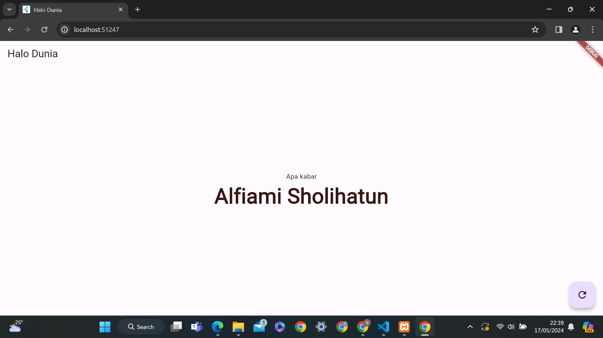

# jobsheet_5
Jobsheet ke 5 Mobile Programming 
Membuat daftar mahasiswa dengan ketentuan menampilkan nama 5
mahasiswa dalam 1 kelas:
a. 2 mahasiswa dengan nomor absen tepat di atas
nomor absen kamu
b. 2 mahasiswa dengan nomor absen tepat di
bawah
nomor absen kamu, dan
c. 1 mahasiswa adalah kamu dan menggunakan
warna
latar hijau.

### Hasil

