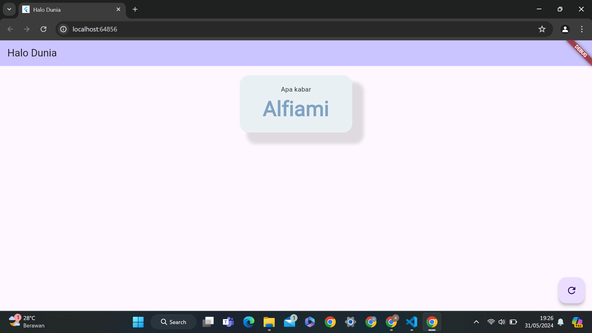

# jobsheet-7 (FLUTTER CONTAINER WIDGET)
Jobsheet ini menjelaskan tentang pengertian Container Widget dalam pengembangan aplikasi menggunakan framework Flutter. Widget container adalah elemen dalam Flutter yang berfungsi sebagai wadah atau pembungkus untuk widget lainnya. Diberi nama 'container' karena memiliki kemampuan untuk menentukan berbagai properti bingkai, seperti padding, margin, border, border radius, box shadow, dan lain-lain. Memahami konsep dan penggunaan Container Widget penting dalam merancang tata letak aplikasi yang responsif dan estetis menggunakan Flutter.

### Hasil

