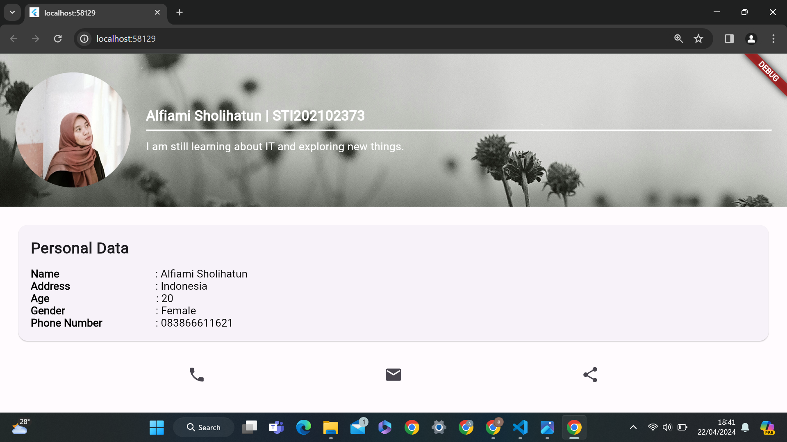

## UTS Mobile Programming - Aplikasi Profil
Ini adalah proyek Ujian Tengah Semester (UTS) Mobile Programming yang mengimplementasikan sebuah aplikasi profil sederhana menggunakan Flutter. Aplikasi ini menampilkan profil pengguna beserta informasi kontak, dan dibangun dengan menggunakan Flutter dan Dart.

Fitur
Tampilan header dengan foto profil dan informasi singkat.
Bagian "Personal Data" menampilkan informasi profil lengkap.
Ikoni kontak untuk telepon, email, dan berbagi.
Tampilan Aplikasi

### Hasil projek setelah di run
